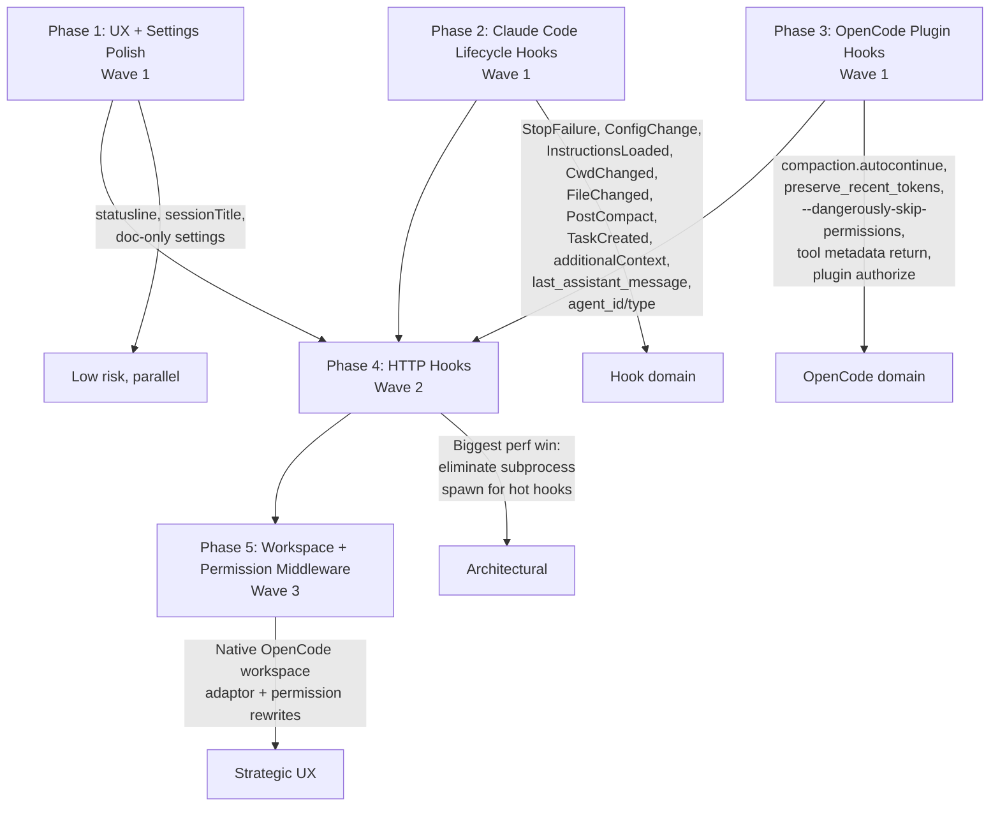

# Claude Code + OpenCode Changelog Integration Master Plan

Created: 2026-04-20
Status: IN_PROGRESS
Approved: Yes
Iterations: 0
Worktree: No
Type: Master

## Goal

Adopt the 21 HIGH-fit capabilities identified in the all-time audit of Claude Code (up to v2.1.116) and OpenCode (through v1.3.x + April 2026 releases) changelogs, measurably improving Sentinal's latency, lifecycle coverage, UX signals, and cross-target integration depth.

## Audit Summary

| Source                 |   HIGH | MEDIUM |    LOW | REJECTED |   Total |
| ---------------------- | -----: | -----: | -----: | -------: | ------: |
| Claude Code (all-time) |     14 |     23 |     17 |        8 |      62 |
| OpenCode (April 2026)  |      7 |     10 |     15 |        9 |      41 |
| **Total**              | **21** | **33** | **32** |   **17** | **103** |

**Prior audits** (not duplicated in this plan — already covered):

- `docs/plans/2026-04-02-claude-code-latest-audit.md` — effort frontmatter, agent `isolation`/`background`/`maxTurns`/`disallowedTools`, hooks `if` matcher, PostCompact/TaskCreated/InstructionsLoaded/PermissionDenied documented-only
- `docs/plans/2026-04-02-opencode-v1.3-parity.md` — `experimental.chat.system.transform`, `experimental.session.compacting`, v1.3.5 async fix audit
- `docs/plans/2026-04-04-awesome-opencode-audit.md` — companion plugin detection

This master plan **implements** the "documented-only" items from the prior audit and adopts everything new since then.

## Architecture

## Context

### Sentinal architecture baseline (shared across all phases)

- **Dual-target:** Claude Code (compiled hooks from `src/hooks/*.ts` → `targets/claude-code/hooks/dist/`) + OpenCode (native TS plugin at `targets/opencode/plugins/sentinal.ts`, currently 1008 lines). **This file is explicitly exempt from Sentinal's 600-line block threshold** because it contains all embedded logic for the OpenCode plugin (single-file plugin format is a platform constraint, not a code smell). DRY principles still apply — shared logic should be extracted to `src/opencode/*.ts` where it improves testability or reuse — but file length alone must not restrict functionality.
- **Sidecar:** long-lived HTTP server at `~/.sentinal/sidecar.sock` (+ HTTP port fallback). Hooks, MCP server, and the OpenCode plugin connect via `SidecarClient` to avoid per-invocation SQLite cold starts (~100ms saved per hook).
- **Current hooks wired:**
  - Claude Code: `SessionStart`, `PreToolUse` (tdd-guard, pre-edit-guide, tool-redirect), `PostToolUse` (tdd-tracker, file-checker, memory-observer, context-monitor), `UserPromptSubmit`, `PreCompact`, `Stop`, `SessionEnd`
  - OpenCode: `tool.execute.before`, `tool.execute.after`, `experimental.session.compacting`, `experimental.chat.system.transform`, `session.created/updated/deleted/idle`

### Dual-target principles (apply to every phase)

- Shared logic in `src/**/*.ts`, target-specific wiring in `targets/**/` (see `.sentinal/rules/sentinal-dual-target.md`).
- Claude Code hooks read JSON on stdin, respond via stdout + exit code (see `.sentinal/rules/sentinal-hooks-development.md`).
- OpenCode hooks are native TS handlers in `targets/opencode/plugins/sentinal.ts`.
- Every new hook or behavior change needs a mapping for BOTH targets where applicable — see the dual-target hook mapping table below.
- File-length limits (warn 400 / block 600) apply to all source files EXCEPT `targets/opencode/plugins/sentinal.ts`, which is exempt due to single-file plugin format. DRY principles still apply — extract shared logic to `src/opencode/*.ts` when testability/reuse benefits exist, but do not extract solely to reduce sentinal.ts line count.

### Dual-target hook mapping

For each new or refactored hook in Phases 2 and 3, this table is the parity contract. Phase-specific tasks must verify these mappings:

| Claude Code Hook (Phase 2)        | OpenCode Equivalent (Phase 3)                                                                    | Action                                                                                       |
| --------------------------------- | ------------------------------------------------------------------------------------------------ | -------------------------------------------------------------------------------------------- |
| `StopFailure`                     | No direct equivalent — OpenCode emits `session.error` via SDK but it's not plugin-hookable today | **CC-only by design.** Document in Phase 2; no Phase 3 work.                                 |
| `ConfigChange`                    | No direct equivalent — OpenCode plugin handler can watch files directly                          | **CC-only natively.** Phase 3 implements file-watcher for `.sentinal/rules/*.md` as a proxy. |
| `InstructionsLoaded`              | Fires implicitly on `session.created` in OpenCode                                                | Map: attach logic to the existing `session.created` handler.                                 |
| `CwdChanged`                      | No direct equivalent                                                                             | **CC-only.** Document; rely on OpenCode's per-workspace isolation instead.                   |
| `FileChanged`                     | No direct equivalent                                                                             | **CC-only.** Document; OpenCode watches via its own workspace sync.                          |
| `PostCompact`                     | `compaction.autocontinue` + `experimental.session.compacting` (post-phase)                       | Map: unify logic in `src/opencode/compaction-autocontinue.ts` and reuse.                     |
| `TaskCreated`                     | Fires implicitly via `session.created` when OpenCode spawns a subagent                           | Map: detect subagent sessions in `session.created` handler.                                  |
| `additionalContext` on PreToolUse | `tool.execute.before` returning `{ output: { ...context } }`                                     | Already the OpenCode pattern — apply the same contract to both.                              |
| `last_assistant_message` in Stop  | `session.idle` handler already has access via `client.session.messages()`                        | Already parity-compatible.                                                                   |
| `agent_id`/`agent_type`           | Available in OpenCode's `tool.execute.before` via `input.sessionID`                              | Parity achievable; document the lookup pattern.                                              |

**Rule:** Every Phase 2 task that implements a CC-only hook must note the OpenCode-side decision (implement-via-proxy / skip-with-rationale) in its per-task documentation.

### Constraints (apply to every phase)

- TDD mandatory for all new TypeScript code (`.sentinal/rules/sentinal-testing.md`).
- Plans that require sidecar round-trips must have graceful fallback to direct invocation.
- Full `npx tsc --noEmit` must pass before commit (new rule from `docs/plans/2026-04-20-spec-verify-full-tsc.md`).
- Every new hook needs a test, even when the "logic" is a thin sidecar proxy.

## Waves

**Wave 1 — Parallel Foundation (Phases 1, 2, 3):** UX polish, Claude Code lifecycle hooks, and OpenCode plugin hooks are **independent** of each other because:

- Phase 1 touches statusline + settings.json + skill frontmatter only (no hook code)
- Phase 2 adds new hook handler files under `src/hooks/` (no existing file conflicts)
- Phase 3 adds new handlers to `targets/opencode/plugins/sentinal.ts` (but via extracted modules to avoid the line-limit conflict)

All three can run in parallel as sub-agents with no file overlap.

**Wave 2 — HTTP Hooks Refactor (Phase 4):** Architectural change that converts hot-path hooks from subprocess spawn to sidecar HTTP. **Must wait for Waves 1** because it reuses/relocates every hook file touched in Phase 2, and the OpenCode plugin refactor lines added in Phase 3 may influence sidecar routing choices.

**Wave 3 — Strategic Integration (Phase 5):** Native OpenCode workspace adaptor + permission middleware. **Must wait for Wave 2** because it depends on HTTP-hook stability (permission middleware fires on every tool use) and integrates with the workspace-session lifecycle that Phase 2's hooks also observe.

## Phases

| Phase | Wave | Title                             | Objective                                                                                                                                                                                                                                                                                                                                                                             | Dependencies   |
| ----- | ---- | --------------------------------- | ------------------------------------------------------------------------------------------------------------------------------------------------------------------------------------------------------------------------------------------------------------------------------------------------------------------------------------------------------------------------------------- | -------------- |
| 1     | 1    | UX + Settings Polish              | Statusline `workspace.git_worktree` + `refreshInterval`, `sessionTitle` on UserPromptSubmit, `once: true` on session-restore hooks, `plansDirectory` setting, `CLAUDE_CODE_SESSIONEND_HOOKS_TIMEOUT_MS`, xhigh effort tuning, `$CLAUDE_PLUGIN_DATA` variable adoption, skill `paths:` frontmatter, `claude plugin validate` in CI, `opencode run --dangerously-skip-permissions` docs | None           |
| 2     | 1    | Claude Code Lifecycle Hooks       | 9 new/refactored Claude Code hooks: StopFailure, ConfigChange, InstructionsLoaded, CwdChanged, FileChanged, PostCompact (implement beyond just awareness), TaskCreated, PreToolUse `additionalContext` refactor, consume `last_assistant_message` + `agent_id`/`agent_type` in existing hooks                                                                                         | None           |
| 3     | 1    | OpenCode Plugin Hooks             | `compaction.autocontinue` hook + `preserve_recent_tokens` awareness + `--dangerously-skip-permissions` integration in spec-master runner + plugin tool metadata return (register at least one native tool) + plugin `authorize` API evaluation                                                                                                                                        | None           |
| 4     | 2    | HTTP Hooks Architecture           | Wire sidecar HTTP routes per hook event (PreToolUse, PostToolUse, Stop/StopFailure, SessionStart/End). Convert `targets/claude-code/hooks.json` to `type: "http"` for hot-path hooks with subprocess fallback declarations. Target: ≥50% hook-invocation latency reduction on typical edit.                                                                                           | Phases 1, 2, 3 |
| 5     | 3    | Workspace + Permission Middleware | (a) Custom OpenCode workspace adaptor registering "Sentinal Spec Worktree" in workspace creation, integrating `worktree_create` + session restore across workspaces + auth carryover. (b) `permissionDecision: "defer"` + `PermissionRequest` `updatedInput` rewrite in Sentinal's tool-redirect + file-checker. (c) `Elicitation`/`ElicitationResult` hooks as safety net.           | Phase 4        |

## Progress Tracking

- [ ] Phase 1: UX + Settings Polish (Wave 1)
- [ ] Phase 2: Claude Code Lifecycle Hooks (Wave 1)
- [ ] Phase 3: OpenCode Plugin Hooks (Wave 1)
- [ ] Phase 4: HTTP Hooks Architecture (Wave 2)
- [ ] Phase 5: Workspace + Permission Middleware (Wave 3)

**Total Phases:** 5 | **Completed:** 0 | **Remaining:** 5

## Goal Verification

### Truths

1. `targets/claude-code/hooks.json` contains hook entries of `type: "http"` for at least 4 hot-path hooks after Phase 4.
2. `bun test src/hooks/stop-failure.test.ts && bun test src/hooks/config-change.test.ts && bun test src/hooks/instructions-loaded.test.ts && bun test src/hooks/cwd-changed.test.ts && bun test src/hooks/file-changed.test.ts && bun test src/hooks/post-compact.test.ts && bun test src/hooks/task-created.test.ts` all pass after Phase 2.
3. `src/sidecar/hook-routes.ts` exists and exports handlers for the 4 hot-path hooks after Phase 4 (grep-verifiable: `export async function handleHookRequest`).
4. `targets/opencode/plugins/sentinal.ts` registers the `compaction.autocontinue` hook handler after Phase 3 (grep-verifiable: `"compaction.autocontinue"`).
5. After Phase 3, new handlers registered in `targets/opencode/plugins/sentinal.ts` are functional (grep-verifiable: handler names appear in the registered hooks object). File length is NOT a gate — the file is exempt from block thresholds per master plan context.
6. `src/cli/commands/statusline.ts` surfaces `workspace.git_worktree` when present after Phase 1 (grep-verifiable: `git_worktree`).
7. Hyperfine benchmark after Phase 4: PreToolUse hook latency median < 30ms (currently ~150-250ms). Recorded in the phase's verification plan.
8. OpenCode workspace creation UI lists "Sentinal Spec Worktree" as an adaptor option after Phase 5 (manual verification; recorded with screenshot).

### Artifacts

| Artifact                                  | Provides                        | Exports                                    |
| ----------------------------------------- | ------------------------------- | ------------------------------------------ |
| `src/hooks/stop-failure.ts`               | StopFailure hook handler        | `handleStopFailure()` + CLI dispatch entry |
| `src/hooks/config-change.ts`              | ConfigChange hook handler       | `handleConfigChange()`                     |
| `src/hooks/instructions-loaded.ts`        | InstructionsLoaded hook handler | `handleInstructionsLoaded()`               |
| `src/hooks/cwd-changed.ts`                | CwdChanged hook handler         | `handleCwdChanged()`                       |
| `src/hooks/file-changed.ts`               | FileChanged hook handler        | `handleFileChanged()`                      |
| `src/hooks/post-compact.ts`               | PostCompact hook handler        | `handlePostCompact()`                      |
| `src/hooks/task-created.ts`               | TaskCreated hook handler        | `handleTaskCreated()`                      |
| `src/sidecar/hook-routes.ts`              | HTTP hook dispatch              | `handleHookRequest()`                      |
| `src/opencode/compaction-autocontinue.ts` | Extracted OpenCode handler      | `handleCompactionAutocontinue()`           |
| `src/opencode/workspace-adaptor.ts`       | Workspace adaptor registration  | `registerSpecWorktreeAdaptor()`            |
| `src/hooks/permission-middleware.ts`      | Permission rewrite middleware   | `handlePermissionRequest()`                |

### Key Links

| From                                   | To                                        | Via                              | Pattern                           |
| -------------------------------------- | ----------------------------------------- | -------------------------------- | --------------------------------- |
| `targets/claude-code/hooks.json`       | `src/sidecar/hook-routes.ts`              | HTTP `type: "http"` hook entries | `"type":\s*"http"`                |
| `targets/opencode/plugins/sentinal.ts` | `src/opencode/compaction-autocontinue.ts` | import                           | `import.*compaction-autocontinue` |
| `targets/opencode/plugins/sentinal.ts` | `src/opencode/workspace-adaptor.ts`       | import                           | `import.*workspace-adaptor`       |
| `src/cli/commands/hook.ts`             | each new hook under `src/hooks/`          | CLI dispatch routing             | `sentinal hook shared .+`         |
| `src/cli/commands/statusline.ts`       | `workspace.git_worktree` field            | statusline input parsing         | `git_worktree`                    |

## Pre-Mortem

_Assume this master plan failed after full execution. Most likely internal reasons:_

1. **sentinal.ts becomes unmaintainable** — Trigger: Phase 3 adds 300+ lines of new handler logic directly inline, turning an already-long file into an unreviewable blob. Mitigation: Extract handler _logic_ to `src/opencode/*.ts` for testability. sentinal.ts keeps the registration surface (1-3 lines per handler: `import + register`). No hard line limit — exemption documented in context — but DRY pushes complexity out of the plugin file.
2. **HTTP hooks regress on sidecar-down path** — Trigger: Phase 4 verification passes in warm-sidecar conditions but breaks on cold-start or sidecar-crashed states. Mitigation: each HTTP hook entry must have a subprocess fallback (either Claude Code-native or via a wrapper). Verify by running tests with sidecar killed.
3. **Dual-target drift** — Trigger: A hook added in Phase 2 (Claude Code) has no OpenCode equivalent added in Phase 3, or vice versa. Mitigation: the dual-target hook mapping table above IS the contract. Phase 2 and Phase 3 tasks must tick off rows of that table as verification.
4. **Workspace adaptor API unstable or nonexistent** — Trigger: Phase 5 Spike (Day 1) fails because OpenCode's custom-workspace-adaptor SDK isn't exposed for third-party plugins. Mitigation: Spike defines explicit failure criteria ("no plugin API surface for adaptor registration AND OpenCode team confirms this is not exposed"). On failure, implement as pseudo-adaptor via existing `/spec` command + `worktree_create` MCP tool (degraded but functional). **User must be re-consulted if Section A of Phase 5 is descoped** — user explicitly marked this "required".
5. **Testing HTTP hooks reliability** — Trigger: Phase 4 subprocess-fallback logic cannot be verified without a brittle sidecar-kill integration test. Mitigation: write test with explicit ≥60s timeout (see `sentinal-test-timing` skill).
6. **HTTP hooks don't exist in Claude Code** — Trigger: Phase 4 Spike Day 1 reveals `type: "http"` was documented but removed, or the payload format is incompatible with our `HookInput` shape. Mitigation: Phase 4 is gated on this spike's success. If it fails, fallback to "keep-alive warm worker" approach (sidecar pre-spawns Bun processes) — documented as Phase 4 Plan B in the child stub.
7. **async:true + HTTP hook semantics undefined** — Trigger: Hooks like `tdd-tracker`, `memory-observer`, `context-monitor` are `async: true` in hooks.json. Unclear whether HTTP hooks support fire-and-forget. Mitigation: Phase 4 Spike MUST test this case explicitly. If async HTTP unsupported, keep async hooks on subprocess (lower-hanging fruit is synchronous PreToolUse hooks anyway).
8. **Port-file race at Claude Code startup** — Trigger: Sidecar picks a port on startup, Claude Code hooks.json is read at session start. Race: Claude Code loads hooks.json BEFORE sidecar has written port-file → hooks point at stale port. Mitigation: Use the well-known Unix socket path `~/.sentinal/sidecar.sock` in hooks.json (not port). Fallback: hook wrapper script synchronously auto-starts sidecar on first invocation.
9. **CI regression from `claude plugin validate`** — Trigger: Phase 1 adds `claude plugin validate` to CI. If Claude Code has tightened validation rules since last run, existing plugin metadata may fail on an unrelated commit. Mitigation: scope initial CI addition to `validate --warn-only` (or equivalent); upgrade to fail-on-error in a follow-up after we see green runs.
10. **`permissionDecision: "defer"` in CI breaks headless runs** — Trigger: Phase 5 adds `defer` to `file-checker`/`tdd-guard`. In CI/headless mode with no resume-capable runner, a `defer` hangs indefinitely. Mitigation: `defer` only activates when `is_nonblocking_session` hook input flag is NOT set. Test must cover both interactive and headless cases.

## Risks and Mitigations

| Risk                                                                       | Likelihood | Impact | Mitigation                                                                                                                        |
| -------------------------------------------------------------------------- | ---------- | ------ | --------------------------------------------------------------------------------------------------------------------------------- |
| Claude Code hook signatures change between versions                        | Medium     | High   | Phase 2 includes a version-guard per hook; skip gracefully if the version in `$SENTINAL_TARGET_VERSION` is < the required minimum |
| OpenCode `compaction.autocontinue` API is experimental and renamed/removed | Medium     | Medium | Wrap handler in try/catch; verify against `@opencode-ai/plugin` types                                                             |
| HTTP hooks introduce a unix-socket/Windows portability bug                 | Medium     | High   | Use the existing `SidecarClient.connect()` abstraction — it already has Windows fallback to HTTP port                             |
| Plan rebases against main get complex with 5 parallel phases               | Low        | Medium | Each phase commits to its own branch under the master worktree; final merge handled per-phase with explicit rebase checks         |
| Over-scoping blocks any progress                                           | Low        | High   | Phase 1 is 100% doc + config changes (~1 day) — can always ship Phase 1 standalone for incremental value                          |

## HIGH-Item Traceability

The 21 HIGH-fit items from the audit must each be adopted. This table is the acceptance artifact — the master plan is not VERIFIED until all rows are Status=DONE.

### Claude Code (14 HIGH items)

| ID    | Name                                                  | Phase | Status  |
| ----- | ----------------------------------------------------- | ----- | ------- |
| CC-1  | `StopFailure` hook event                              | 2     | PENDING |
| CC-2  | `ConfigChange` hook event                             | 2     | PENDING |
| CC-3  | `InstructionsLoaded` hook event                       | 2     | PENDING |
| CC-4  | `CwdChanged` / `FileChanged` hook events              | 2     | PENDING |
| CC-5  | `permissionDecision: "defer"` on PreToolUse           | 5     | PENDING |
| CC-6  | `additionalContext` return on PreToolUse              | 2     | PENDING |
| CC-7  | HTTP hooks (`type: "http"`)                           | 4     | PENDING |
| CC-8  | `hookSpecificOutput.sessionTitle` on UserPromptSubmit | 1     | PENDING |
| CC-9  | `last_assistant_message` on Stop input                | 2     | PENDING |
| CC-10 | `agent_id`/`agent_type` on hook events                | 2     | PENDING |
| CC-11 | `workspace.git_worktree` in status line               | 1     | PENDING |
| CC-12 | Status line `refreshInterval`                         | 1     | PENDING |
| CC-13 | `isolation: worktree` in agent defs (research only)   | 1     | PENDING |
| CC-14 | `memory` frontmatter for agents                       | 1     | PENDING |

### OpenCode (7 HIGH items)

| ID   | Name                                            | Phase | Status                                                          |
| ---- | ----------------------------------------------- | ----- | --------------------------------------------------------------- |
| OC-1 | `compaction.autocontinue` experimental hook     | 3     | PENDING                                                         |
| OC-2 | Plugin tool execution results return `metadata` | 3     | PENDING                                                         |
| OC-3 | Plugin `authorize` / `auth login` API           | 3     | PENDING (descoped per plan-reviewer; move to "future work" doc) |
| OC-4 | Custom workspace adaptors via plugins           | 5     | PENDING                                                         |
| OC-5 | `opencode run --dangerously-skip-permissions`   | 1 + 3 | PENDING                                                         |
| OC-6 | Workspaces carry auth context across sessions   | 5     | PENDING (verification only)                                     |
| OC-7 | `preserve_recent_tokens` compaction setting     | 3     | PENDING                                                         |

**Note on OC-3:** The plan-reviewer flagged this as YAGNI — Sentinal has no cloud-sync feature today. Demoted to "future work" note in Phase 3 rather than a decision-doc deliverable.

## Testing Strategy

- **Per-phase:** Full bun test suite + `npx tsc --noEmit` + `npx ng build` (if touched) + phase-specific regression tests.
- **Post-Wave 1 (Phases 1-3):** Full reinstall in a test project, verify statusline, hook firing, and OpenCode plugin load with `~/.sentinal/plugin.debug.log` observation.
- **Post-Wave 2 (Phase 4):** Hyperfine benchmark comparing hook latency before/after HTTP conversion with warm sidecar; subprocess-fallback verification with sidecar killed.
- **Post-Wave 3 (Phase 5):** Manual E2E: create a spec via `/spec`, select "Sentinal Spec Worktree" in OpenCode workspace picker, verify native integration end-to-end.

## Runtime Environment

- **Local development:** `bun run build:all` for full build. `bun run install:claude-code` / `bun run install:opencode` for target install. Tests: `bun test`. TSC: `bunx tsc --noEmit`.
- **Sidecar:** `~/.sentinal/sidecar.pid` / `.sock` / `.port`. Restart: `kill $(cat ~/.sentinal/sidecar.pid); rm ~/.sentinal/sidecar.{sock,port,pid}`.
- **Release:** Automated via `semantic-release` (see `.releaserc.json`). Each phase should merge to main via normal commit messages; CI version-bump follows.

## Assumptions

- The Claude Code + OpenCode APIs referenced in the audit are stable or experimental-but-usable as of the versions tested — supported by changelog entries and prior audit plans that successfully integrated experimental APIs (`experimental.chat.system.transform`) — all phases depend on this.
- HTTP hooks in Claude Code accept the same JSON payload shape as command hooks — supported by changelog entry for v2.1.63 — Phase 4 depends on this. **⚠️ CC 2.1.118 introduced `type: "mcp_tool"` hooks — this may be a superior alternative to HTTP hooks. Phase 4 spike must evaluate both.**
- OpenCode's workspace adaptor SDK is usable by plugins without a marketplace submission — needs verification; treated as a Spike in Phase 5 — Phase 5 depends on this. **✅ OC 1.4.4 confirmed `WorkspaceAdaptor` API exists; OC 1.14.20 adds `env` param to `create()`; OC 1.14.32 fixes instance context bug.**
- The sidecar socket path is accessible from Claude Code's hook execution context (same user, same machine) — supported by current command-hook operation — Phase 4 depends on this.

## Changelog Re-Audit (2026-05-26)

**Versions audited:** CC 2.1.117–2.1.142 (26 releases), OC 1.4.0–1.15.10 (~80 releases).

This section tracks new capabilities discovered since the master plan was written (against CC 2.1.116, OC ~1.3.x). Each item is tagged with the phase it affects and a recommended action.

### Critical: Phase 4 — `type: "mcp_tool"` hooks (CC 2.1.118)

Claude Code now supports hooks of `type: "mcp_tool"` that invoke MCP tools directly. Since Sentinal already runs an MCP server with 26+ tools, this could **eliminate the need for `src/sidecar/hook-routes.ts`** and the entire HTTP-route approach. Phase 4 spike MUST evaluate this alongside `type: "http"`. If MCP-tool hooks receive `HookInput` JSON and can return `HookOutput`, they are strictly preferable — no new routes, no port/socket race, leverages existing infrastructure.

### High: Phase 2 — `updatedToolOutput` universal (CC 2.1.121)

`hookSpecificOutput.updatedToolOutput` now works for ALL tools, not just MCP. CC-6 (`additionalContext` refactor on PreToolUse) should evaluate using `updatedToolOutput` for same-turn feedback (e.g., file-checker injecting warnings into the tool result Claude sees) versus `additionalContext` for next-turn context injection. Both have valid use cases.

### High: Phase 5 — `continueOnBlock` (CC 2.1.139)

New `continueOnBlock: true` config on PostToolUse hooks feeds the rejection reason back to Claude instead of hard-blocking. This is a lighter alternative to `permissionDecision: "defer"` for soft-deny scenarios (e.g., file-checker warnings where Claude should self-correct). Phase 5 should evaluate `continueOnBlock` as default for soft-deny, reserving `defer` for true blocking (TDD guard).

### Medium: Phase 2 — `duration_ms` in PostToolUse (CC 2.1.119)

PostToolUse/PostToolUseFailure now include `duration_ms`. `memory-observer` and `context-monitor` can consume this natively instead of maintaining internal timers.

### Medium: Phase 2 — Stop-hook block cap (CC 2.1.143)

Stop hooks that block repeatedly now end the turn after 8 consecutive blocks (configurable via `CLAUDE_CODE_STOP_HOOK_BLOCK_CAP`). `spec-stop-guard` must be aware and tested against this limit.

### Medium: Phase 4 — `args` exec form + `alwaysLoad` (CC 2.1.139, 2.1.121)

- `args: string[]` hook field spawns commands directly without shell (eliminates quoting issues for subprocess fallback).
- `alwaysLoad: true` MCP server config ensures all tools are available immediately without tool-search deferral. Add to Sentinal's `.mcp.json`.

### Medium: Phase 3 — OC `api.command` deprecated (OC 1.14.45)

`api.command` deprecated in favor of `api.keymap` for TUI plugins. Check if `sentinal.ts` uses `api.command`; migrate if so.

### Medium: Phase 3 — OC instruction precedence change (OC 1.14.30)

Global instructions now load BEFORE project/skill instructions. Verify Sentinal's global rules (`~/.config/opencode/AGENTS.md`) don't conflict with project-level `.sentinal/rules/`.

### Medium: Phase 3 — OC effect-based event system (OC 1.15.0)

Core event system moved to effect-based delivery for plugins. May change how events reach the plugin — needs verification during Phase 3 planning.

### Medium: Phase 5 — `worktree.baseRef` setting (CC 2.1.133)

New setting controls whether worktrees branch from `origin/<default>` (default) or local HEAD. Sentinal's `worktree_create` should read and respect this.

### Low: Phase 2 — Agent frontmatter `hooks:` fire (CC 2.1.117)

Hooks declared in agent frontmatter now fire at runtime. Sentinal could ship agent definitions with embedded hook configs, reducing user setup friction. Evaluate as an alternative delivery mechanism.

### Low: Misc

- CC 2.1.133: Hooks receive `effort.level` + `$CLAUDE_EFFORT` env var — useful for effort-aware `pre-edit-guide`.
- CC 2.1.132: `CLAUDE_CODE_SESSION_ID` env var available to Bash subprocesses.
- CC 2.1.139: `CLAUDE_PROJECT_DIR` env var sent to MCP stdio servers.
- CC 2.1.141: `terminalSequence` in hook output — desktop notifications, bells.
- OC 1.15.1: Preserved custom tool metadata from Zod schemas (strengthens OC-2).

### Confirmed OC items (all 7 HIGH items from master plan are shipped)

| Item                                  | OC Version | Status                   |
| ------------------------------------- | ---------- | ------------------------ |
| OC-1 `compaction.autocontinue`        | 1.4.4      | ✅ Landed (experimental) |
| OC-2 Plugin tool metadata return      | 1.4.8      | ✅ Landed                |
| OC-4 Custom workspace adaptors        | 1.4.4      | ✅ API exists            |
| OC-5 `--dangerously-skip-permissions` | 1.4.0      | ✅ Landed                |
| OC-6 Workspace auth carryover         | 1.4.7      | ✅ Confirmed             |
| OC-7 `preserve_recent_tokens`         | 1.14.19    | ✅ Landed (renamed)      |

ARGUMENTS: $ARGUMENTS
