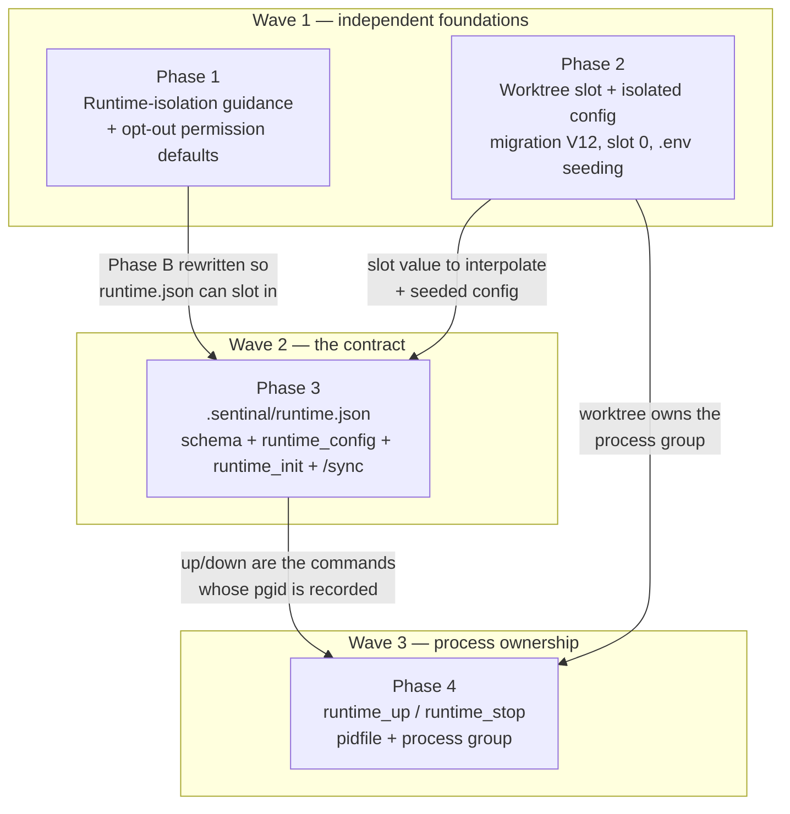
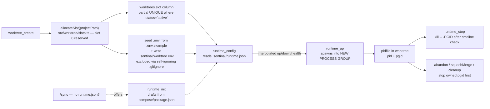

# Worktree Runtime Isolation Master Plan

Created: 2026-08-07
Status: COMPLETE
Approved: Yes
Iterations: 2
Worktree: Yes
Type: Master
Issue: #2

## Goal

A Sentinal worktree isolates **code** but not **runtime** — ports, databases, caches and OS processes are still shared with the developer's main checkout and every other concurrent worktree. Close that gap with the smallest set of primitives that only Sentinal can provide: shared-state reasoning in the verify guidance, a per-worktree **slot** with isolated config seeded at creation, an opt-in `.sentinal/runtime.json` contract with a scaffolder, and process ownership so a spec can stop what it started without a pattern-kill.

**This plan deliberately diverges from issue #2 in four places.** Each divergence is recorded as a decision below with its rationale.

## Context

### The incident being fixed (issue #2)

An agent verifying a change in a worktree: found the default port busy → improvised another port → **copied the repo-root `.env` in** → booted **against the developer's live local databases** → cleaned up with `pkill -f "<path-fragment>"`, killing the developer's own dev server.

Issue body captured verbatim at `docs/plans/2026-08-07-worktree-runtime-isolation-issue-2.md`.

### What the shipped guidance actually says today

Exhaustive grep across all shipped markdown (`lsof|ps aux|pkill|kill -9|killall|port availability|Parallel spec`) returns **6 hits**, only 4 in verify/implement:

| File                                                | Line | Text                                                                                                  |
| --------------------------------------------------- | ---- | ------------------------------------------------------------------------------------------------------ |
| `targets/claude-code/commands/spec-verify.md`       | 221  | "Check `ps aux \| grep <service>` before restarting shared services."                                 |
| `targets/claude-code/commands/spec-verify.md`       | 236  | "**⚠️ Parallel spec warning:** Before starting a server, check port availability: `lsof -i :<port>`." |
| `targets/opencode/skills/spec-verify/SKILL.md`      | 219  | identical (offset −2)                                                                                  |
| `targets/opencode/skills/spec-verify/SKILL.md`      | 234  | identical (offset −2)                                                                                  |
| `targets/claude-code/commands/spec-implement.md`    | 193  | "**Run actual program** — use plan's Runtime Environment section. Check port: `lsof -i :<port>`"       |
| `targets/opencode/skills/spec-implement/SKILL.md`   | 189  | identical (offset −4)                                                                                  |

Negative findings that define the gap:

- **No instruction to kill a process** anywhere — the agent improvised `pkill -f`. And no instruction to *stop* a server started in Step 3.7 either; only Playwright gets a `close` (Step 3.9c).
- **No port-conflict resolution guidance** — `lsof -i` is stated with no action on conflict.
- **No mention of database, cache, or queue sharing** at any point, and nothing about `.env` handling.
- `spec-bugfix-verify` says `stop service` (CC:68 / OC:66) — the sole teardown instruction in the corpus — with no mechanism, no port check, no parallel warning.

### Load-bearing discoveries from exploration

1. **There was no env-var injection mechanism, at all** — *state of the codebase BEFORE Phase 2, which has since added seeding + the slot env file.* `WorktreeManager.create()` (`src/worktree/manager.ts:69-141`) does exactly two side-effecting things — `git worktree add` (`:116-119`) and `store.insert()` (`:125-135`). It writes **no files** into `worktreePath`. Every `SENTINAL_*` variable is a bare read-only `process.env[...]` read (`src/spec/mcp-tools.ts:226-233` + 6 others). Subprocess spawns use `env: { ...process.env }` pass-through with zero additions. **Slot delivery and config seeding are greenfield.**

2. **`src/worktree/manager.ts` is 542 lines** against Sentinal's own 600-line block limit. New logic must go in new modules.

3. **`worktree_create` / `worktree_detect` do not return JSON.** Both build a `lines[]` array and emit Markdown (`src/worktree/mcp-tools.ts:126-135`, `:86-96`). Only the CLI emits real JSON (`src/cli/commands/worktree.ts:319-326`, `:279-288`).

4. **There is no cross-target content-parity test.** `spec-verify.md` and `spec-verify/SKILL.md` are byte-identical from line 5 onward except 5 hunks (frontmatter + 4 `sentinal:` namespace prefixes), kept in sync **by hand**. The generator was deleted deliberately and its absence is asserted by `src/cli/commands/no-leak.test.ts:64-74`.

5. **`.sentinal/runtime.json` does not exist anywhere** — repo-wide grep returns 0 hits. **No code parses `## Runtime Environment`** either; `src/spec/` plan-parsing does not extract it. It is purely LLM-read prose, consumed at exactly 6 places (see Phase 3).

6. **Both platforms already ship a permission system, and Sentinal leaves the shell policy empty.** `targets/claude-code/settings.json` opens `permissions.allow` with a **bare `"Bash"` entry (`:11`)** permitting every shell invocation, alongside `Bash(rm:*)` (`:36`), with `"deny": []` (`:75`). `targets/opencode/opencode.json:6-17` declares `permission.skill` and `permission.edit` but **no `permission.bash` key at all** — and `:19-51` adds per-agent `permission` blocks for `build` and `plan` carrying only `task` and `edit`. OpenCode's `permission.bash` supports `"ask"` — a **native confirmation prompt**. See D4, and R16 for the shadowing question.

7. **`/sync` already exists as the "inspect the codebase and generate project config" command** (`targets/claude-code/commands/sync.md`, `targets/opencode/commands/sync.md`, 564 lines). It is the natural invocation point for a runtime-contract scaffolder — no new user-facing command needed. See D9.

### Approved decisions

| #      | Decision                                                                                                                                                                                                                                                                                                                                                                                                                                                                                    |
| ------ | ------------------------------------------------------------------------------------------------------------------------------------------------------------------------------------------------------------------------------------------------------------------------------------------------------------------------------------------------------------------------------------------------------------------------------------------------------------------------------------------- |
| **D1** | **Slot delivery = tool output + Sentinal-side interpolation, AND a written env file.** `worktree_create`/`worktree_detect` surface the slot; Sentinal expands `${SENTINAL_WORKTREE_SLOT}` in `runtime.json` commands itself; **and** a sourceable `KEY=VALUE` file is written into the worktree. **RESOLVED by the Phase 2 Task 1 spike (2026-08-07): a self-ignoring worktree-local `.gitignore`.** The `$GIT_DIR/info/exclude` candidate is **disproven in both forms** — `git rev-parse --git-path info/exclude` resolves to the **common** dir and leaks into the developer's main checkout; the per-worktree gitdir's `info/exclude` is never read by git. Tiered mechanism: (1) if `git check-ignore` already covers the path, write nothing; (2) if `<worktree>/.gitignore` is untracked/absent, create it listing **itself**; (3) if it is **tracked, refuse to modify it** and warn (appending would leave `M .gitignore` for `git add -A` to sweep into a commit); (4) sentinal-owned files live under `<worktree>/.sentinal/` whose tracked `.gitignore` already starts with `*`. |
| **D2** | **Slot uniqueness is per project path.** Matches existing `countActive(projectPath)` / `maxActive` semantics (`src/worktree/store.ts:139-154`, `manager.ts:84-90`). Two different repos may both hold slot 1.                                                                                                                                                                                                                                                                                 |
| **D3** | **Sentinal spawns runtime commands** via `runtime_up` / `runtime_stop`, owning the PIDs it started.                                                                                                                                                                                                                                                                                                                                                                                          |
| **D4** | **⚠️ DIVERGES FROM ISSUE — no destructive-command guard is built.** Issue #2 Tier 4 proposes Sentinal intercept `pkill -f` / `killall` / `rm -rf` / `git checkout .`. **Rejected.** Shell safety is user configuration, not Sentinal's remit (Sentinal enforces *quality*: TDD, file length, framework patterns). Both platforms already provide the mechanism, and OpenCode's `permission.bash: "ask"` is a **native prompt** that a hook could only approximate badly. See "Why not a guard". |
| **D4a**| **Instead:** Phase 1 ships an **opt-out permission default** (`pkill`/`killall` → `ask`) in `settings.json` + `opencode.json`. Zero code, zero hot-path cost. **Three caveats to resolve in Phase 1, not assume:** (i) if the CC default lands under `MARKETPLACE_DIR`, `install.ts:346-347` `rmSync`s it every update, so a user's deletion is **guaranteed** to revert (R12); (ii) `opencode.json:19-51` declares **per-agent** `permission` blocks for `build` and `plan` — and `build` runs `/spec`; if those *replace* rather than merge, a top-level `permission.bash` is inert exactly where it matters (R16); (iii) `settings.json:11` opens `allow` with a bare `"Bash"`, so `ask` precedence over a blanket allow must be confirmed.                                                                                                                                                                                                                        |
| **D5** | **⚠️ DIVERGES FROM ISSUE — process ownership is a worktree-local pidfile + process group, NOT a sidecar-resident supervisor.** `runtime_up` spawns detached into a **new process group**, writing `pid`/`pgid` into the worktree. `runtime_stop` is `kill -- -$PGID` after a liveness + cmdline check. Staleness is checked on read. **No `runtime_processes` table, no migration V13, no `SidecarContext` change, no sidecar route, no reconciliation sweep.** See "Why not a supervisor".      |
| **D6** | ⚠️ **CORRECTED 2026-08-09 — shipped NARROWED to the `${SENTINAL_*}` prefix** (`src/runtime/interpolate.ts:22-28`). A blanket "any unknown `${TOKEN}` is an error" rule rejects legitimate shell — `up`/`down` ARE shell strings, e.g. `PORT=${PORT:-3000} npm start` — and does not catch the bare-dollar `$UNSET` cited to justify it. Only `${SENTINAL_*}` tokens are validated; every other `${...}` and every bare `$VAR` passes through verbatim. **The text that follows is the original and is superseded.** **Interpolation namespace is closed and validated.** v1 substitutes exactly `${SENTINAL_WORKTREE_SLOT}`. **No `process.env` fallthrough.** Unknown `${TOKEN}` = **zod validation error naming the token**, never silent empty-string substitution (that is how `rm -rf $UNSET/` accidents happen). Also removes the issue example's undefined `${PORT}`.                                                                                                                                       |
| **D7**  | **⚠️ ADDS TO ISSUE — slot 0 is reserved for the developer's main checkout; allocation starts at 1.** Precisely: **slots are allocated from the closed range `[1, maxActive]`. Slot 0 is never allocated and is NOT counted against `maxActive`, so capacity is unchanged (default: 5 concurrent worktrees, slots 1–5).** **CORRECTED after Phase 2 review:** `create()` checks `maxActive` first, but `countActive` counts only `'active'` while the slot pool covers the LIVE set (`active` + `ready-to-merge`). So `SLOT_EXHAUSTED` **is** reachable from `create()` — when `ready-to-merge` rows hold slots `countActive` does not count. It is otherwise raised by the reconcile path (no capacity guard) and by lost races. (The earlier "unreachable via `create()`" contradicted R3.)** The issue's proposal allocates from a pool of *active worktree records*, and **the main checkout is never a worktree record** (`store.countActive` counts DB rows only). Without this, the first worktree gets the number the developer's own default stack is already using — the exact collision the tier exists to prevent.                                                             |
| **D8** | **⚠️ ADDS TO ISSUE — worktree creation seeds isolated config from `.env.example`.** Incident step 3 was "copied the repo root `.env`" — that is *why* it hit live databases, and no tier in the issue addresses it. Git worktrees correctly do not inherit gitignored files; the agent worked around it. Seeding a slot-substituted `.env` from `.env.example` attacks the root cause directly. If `.env.example` is absent, **warn loudly** rather than silently doing nothing.                |
| **D9** | **⚠️ ADDS TO ISSUE — `runtime_init` scaffolds `.sentinal/runtime.json`, invoked from `/sync`.** The issue states the file is project-authored; adoption is then the entire ballgame, and the plan's own residual risk concedes non-adopters get nothing. `/sync` already inspects the codebase and generates project config, so it detects a missing `runtime.json` and offers to draft one from `docker-compose.yml` / `package.json` scripts / `Procfile`. Scaffolding is not ownership.      |
| **D10** | **⚠️ DIVERGES FROM ISSUE — `isolation` is a three-state map (`isolated`/`shared`/`none`), not an array, and absence means `unknown`.** The issue's `["ports","database","cache"]` cannot distinguish "no cache" from "shared cache" — both omit `cache`, so `spec-verify` would warn about a cache that does not exist. **Only an explicit human-written `"shared"` blocks; `unknown` is reported non-blockingly and NEVER prompts.** A prompt that fires on every run carries no information and trains the user to wave through "not isolated". See "The `isolation` contract". |
| **D11** | **⚠️ ADDS TO ISSUE — E2E tooling is tool-agnostic, and the browser is treated as shared runtime state.** Today `targets/*/rules/playwright-cli.md` declares playwright-cli "**MANDATORY** for E2E testing of any app with a UI" and `spec-verify.md:299` hard-codes "Resolve Playwright Session". **Chrome DevTools MCP is equally viable when installed** and appears nowhere in the repo. Phase 1 generalises the guidance to either tool, **detect-if-present — Sentinal does not install Chrome DevTools MCP**. See "Browser automation is shared runtime state". |
| **D12** | **⚠️ ADDS TO ISSUE — the `up`/`health`/`down` lifecycle is fully specified, borrowing proven semantics rather than inventing them.** The issue gives three bare command strings with no timeout, poll cadence, readiness taxonomy, log capture, shutdown escalation, or failure semantics. Field set follows **Playwright `webServer`** and **Testcontainers wait strategies**. **The single most important rule: an occupied port is a hard failure, never a prompt to improvise a different port** — that improvisation is step 2 of the incident. See "The runtime lifecycle contract". |

### Why not a guard (rationale for D4)

1. **It is not Sentinal's remit.** Sentinal enforces quality — TDD, file length, framework patterns. General shell safety is a different product. The repo already reached this conclusion: `docs/plans/2026-04-04-awesome-opencode-audit.md:26` classifies `kenryu42/claude-code-safety-net` as a **"Companion"**, not a gap to close in-house.
2. **The platforms already do it, better.** OpenCode `permission.bash: "ask"` is a native confirmation prompt with full agency. A hook cannot match that — `tool.execute.before` can only `throw` (`targets/opencode/plugins/sentinal.ts:464`), and its hint path writes to a log the agent never reads.
3. **The warn-only version would have been near-worthless.** A hint the model may ignore does not prevent anything; and on OpenCode it would have been invisible.
4. **The cost was concentrated in the parts with least value.** `rm -rf` / `git checkout .` detection required a `getRepoRoot()` git subprocess on the PreToolUse hot path (before *every* Bash call), a regex prefilter and memoization to claw the cost back, and shell-parsing caveats for `&&` / quoting / `$(...)` with real false-positive risk.
5. **The real fixes are elsewhere in this plan.** Phase 1 says "never terminate by name or pattern" explicitly; Phase 4 makes the correct alternative trivially available (`runtime_stop`, or `kill -- -$PGID` from a recorded pidfile). A guard would be belt-and-braces on top of both.

### Why not a supervisor (rationale for D5)

The rejected design was: detached spawn + `runtime_processes` table (migration V13) + warm registry in `SidecarContext` + new `src/sidecar/runtime-routes.ts` + client methods + reconciliation sweep on sidecar start + PID-reuse validation. That is a small reimplementation of `foreman`/`overmind`, and process supervision is unforgiving (zombie reaping, signal forwarding, cross-platform pgid semantics).

The pidfile keeps 100% of D3's property — **Sentinal owns the PIDs it started** — because a process group started by Sentinal is still owned by Sentinal. Staleness is checked on read (`process.kill(pid, 0)` + cmdline still references the worktree path), so the sweep is unnecessary. The file lives in the worktree, so it dies with the worktree and `abandon`/`squashMerge`/`cleanup` simply read it. The only capability lost is cross-project querying ("list all running runtimes"), which nothing needs.

**This also dissolves R7:** the sidecar self-terminating when no sessions are active (`src/mcp/server.ts:67`) is irrelevant to a detached process group tracked by a file.

### The `isolation` contract (rationale for D10)

**What it is for:** it declares **what `up` actually namespaces per-slot** — the *residual sharing that remains after `up` runs*. If there is no `up`, everything is shared and the field is moot.

**Why it carries information `up` does not:** the common half-measure is a start command that parameterizes the port (a `--port` flag) while the database URL still comes from a shared `.env`. That is precisely the incident: a free port was found, isolation was inferred, and the database was shared. Nothing in the system could express that distinction.

**Shape (three states per resource):**

```jsonc
"isolation": {
  "ports":    "isolated",  // up namespaces this per-slot
  "database": "shared",    // ← confirmation required before up
  "cache":    "none"       // project has no cache — say nothing
}
```

**Rules:**

1. **⛔ Unstated is `unknown`, NOT `shared`. `unknown` never prompts.** An earlier draft made absence default to `shared` *and* made any `shared` entry blocking. Composed with D9 (the scaffolder omits `isolation`), that produced **a confirmation prompt on every run of every project** — the precise alarm fatigue this map exists to avoid, and a prompt answered reflexively teaches the user to wave through *"not isolated."* A prompt that always fires carries no information.
2. **Only an explicit, human-written `"shared"` blocks.** That is a deliberate, audited declaration and therefore rare and high-signal — worth interrupting for. Everything else proceeds.
3. **`unknown` is reported, never prompted.** Silence is still never an all-clear: unresolved resource classes are surfaced **non-blockingly** in the run context/summary. This preserves the intent of the old rule 1 (don't pretend absence means isolated) without spending the user's attention on it.
4. **Closed vocabulary** (zod enum) so the agent can reason without string-matching guesswork, plus an `other` entry carrying a free-form description for resource classes the enum does not cover.
5. **The blocking rule applies to starting ANYTHING** — via `up`, or by running the program by hand per the Phase 1 guidance — not just to `up`. Gating on `up` alone would leave an explicit `"database": "shared"` inert for a project with no `up` (legal: `readiness` is required only *when* `up` is present). Do *not* attempt to classify the change as "stateful" first — an agent cannot reliably know whether a verification run writes session rows, migrations or audit logs.
6. **A false all-clear is worse than no file.** If a project declares `"database": "isolated"` and `up` does not actually namespace it, the agent proceeds without the confirmation an explicit `shared` would have demanded. Sentinal cannot verify the claim, so the mitigation is structural: **the D9 scaffolder omits the `isolation` map entirely** — not merely `isolated`. Every value it could emit is unsafe (`isolated`; and `none`, which suppresses reporting on absence-of-evidence) or inert (`shared` would now be a *false* block, since the scaffolder cannot know it is true). Underlying principle: **scaffold fields whose errors are loud; never the field whose errors are silent.**

**Effective behaviour:**

| Declaration            | Blocks? | Reported?              |
| ---------------------- | ------- | ---------------------- |
| `"isolated"`           | no      | no                     |
| `"shared"` (explicit)  | **yes** | yes                    |
| `"none"`               | no      | no                     |
| absent (`unknown`)     | **no**  | yes, **non-blocking**  |

A scaffolded project therefore runs with **zero prompts**, and an unconfigured project behaves exactly as it does today plus a line of context.

**Cross-phase link:** this map is the durable fix for **R11**. Phase 2 seeds `.env` from `.env.example`; when that file is not slot-aware, Phase 2 can only emit a blanket "may not be isolated" warning. Once the map exists, that warning names the specific resources still shared.

### The runtime lifecycle contract (rationale for D12)

Issue #2 specifies `bootstrap` / `up` / `down` / `health` as **four bare strings**. That leaves every operationally important question undefined. Prior art converges hard, so the design borrows rather than invents.

#### Prior art

| Concern             | Playwright `webServer`                            | Testcontainers                                              | docker-compose             | Issue #2 spec |
| ------------------- | ------------------------------------------------- | ----------------------------------------------------------- | -------------------------- | ------------- |
| Readiness signal    | `url` \| `port` \| `wait.stdout/stderr` regex     | `ForHTTP` / `ForLog` / `ForListeningPort` / `ForExec` / `ForSQL` | `healthcheck.test`     | HTTP URL only |
| Startup budget      | `timeout` (60s default)                           | `WithStartupTimeout` (60s default)                          | `start_period` + `retries` | **absent**    |
| Poll cadence        | internal                                          | `WithPollInterval` (100ms default)                          | `interval`                 | **absent**    |
| Already running     | `reuseExistingServer`                             | n/a — always fresh                                          | n/a                        | **absent**    |
| Log capture         | `stdout`/`stderr: "pipe" \| "ignore"`             | container logs                                              | `docker logs`              | **absent**    |
| Shutdown            | `gracefulShutdown: {signal, timeout}` → SIGKILL   | `Terminate()` + **Ryuk reaper sidecar**                     | `stop_grace_period`        | **absent**    |
| Teardown on failure | automatic                                         | Ryuk — because `defer` cannot survive SIGKILL               | `--abort-on-container-exit`| **undefined** |

#### Three findings that change the design

1. **Log capture is a safety feature, not a convenience.** An agent facing a failed `up` with no logs is blind, and a blind agent improvises — which is precisely the behaviour that produced this issue. `stdout`/`stderr` capture is mandatory, and the failure message must include a log tail.
2. **Testcontainers ships an entire sidecar container (Ryuk) to guarantee reaping**, because language-level `defer`/`finally` cannot survive a SIGKILL. This validates D5: the worktree-local pidfile **is** the durable reaper record, and `worktree_cleanup` / `abandon` / `squashMerge` are the sweep.
3. **Playwright defaults `reuseExistingServer: !process.env.CI`** — a heuristic. We can do strictly better, because the pidfile tells us *whose* process holds the port.

#### ⛔ The rule that matters most for issue #2

**An occupied port is a hard failure. Never improvise a different port.** Current guidance (`spec-verify.md:236`) says to check `lsof -i :<port>` and implicitly authorises picking another — that is step 2 of the incident, and it is how a second stack ends up pointed at shared state. With slots, an occupied slot port means exactly one of two things:

| Condition                                                              | Action                                                                     |
| ---------------------------------------------------------------------- | --------------------------------------------------------------------------- |
| Pidfile `state=ready`, alive, cmdline references this worktree         | **Reuse** the running stack — and mark the run `reused` (see teardown)     |
| Pidfile `state=starting`, alive, cmdline matches                       | A previous `runtime_up` was **interrupted mid-startup** — tear that group down, then spawn fresh |
| Pidfile alive, cmdline mismatch (PID reuse)                            | **Fail** — foreign process                                                  |
| Pidfile leader dead **but the recorded port is still bound**           | Orphaned group. `kill -- -$PGID` (the pgid outlives the leader), re-probe; if still bound, **fail** naming the pgid. **Do not spawn.** |
| Pidfile stale, port free                                               | Delete it, continue to spawn                                                |
| Port occupied, **no** pidfile                                          | **Fail loudly.** Never re-port                                              |

#### Lifecycle state machine

```
runtime_up
├─ preflight (table above)
├─ spawn detached, new pgid, stdout+stderr → log file
├─ WRITE PIDFILE IMMEDIATELY (state=starting)   ← before polling, NOT after
├─ poll readiness every pollIntervalMs until startupTimeoutMs
│  ├─ probe passes              → pidfile state=ready → READY
│  ├─ leader exits NON-ZERO     → FAIL FAST (do not wait out the timeout) + log tail
│  ├─ leader exits ZERO         → detaching starter; KEEP POLLING (see below)
│  └─ timeout                   → run `down` → FAIL + log tail
└─ READY
   ├─ tests
   ├─ liveness re-check before declaring pass   ← "tests green but the server died" is a false pass
   └─ teardown — every exit path, FOR STACKS THIS INVOCATION STARTED
      ├─ if `reused` → leave running, report "reused"   ← never kill what we didn't start
      ├─ `down` if declared (bounded by graceMs)
      ├─ SIGTERM → pgid, wait graceMs, SIGKILL → pgid
      └─ remove pidfile (idempotent)
```

**⚠️ The pidfile is written on spawn, not on readiness.** Writing it only on the success path would leave the entire startup window (up to `startupTimeoutMs`, default 60s) with a detached process group and **no ownership record on disk** — exactly the orphan D5 claims to prevent, and it would then trip the "port occupied, no pidfile → fail" rule on the next attempt, permanently wedging the worktree. A record written only on success is not a reaper record.

**⚠️ A zero-exit `up` is a detaching starter, not a failure.** `docker compose up -d`, `pm2 start`, and any backgrounding script exit 0 immediately **by design**. Fail-fast must therefore key on a **non-zero** exit. This matters because `docker compose -p sentinal-${SENTINAL_WORKTREE_SLOT} up` is the flagship case named in the Scope ceiling below.

**⚠️ For detaching starters the pgid owns nothing** — the spawned group is a one-shot CLI that has already exited, so `kill -- -$PGID` would silently succeed while the stack keeps running. Therefore: **`down` is REQUIRED when the runtime is detached**, and for container-backed runtimes the ownership guarantee reduces to *"we ran the declared `down`"*, not *"we own the PIDs."* Phase 3 carries a `detached` flag (or infers it from a zero-exit `up`); Phase 4 branches on it.

**Three rules stated explicitly, because all three were previously undefined:**

- **`down` runs after a failed `up`.** A partial start still started things. Compensating teardown is mandatory (the `ExecStopPost` / `defer Terminate()` pattern).
- **`down` must be idempotent** — safe when nothing is running, and safe to call twice.
- **A reused stack is never torn down.** Playwright's `reuseExistingServer` — the prior art this improves on — explicitly leaves a reused server running. Teardown applies only to stacks this invocation started.

#### Cut from v1 (consistent with earlier YAGNI cuts)

Composite `ForAll` probes; SQL/database probes; restart-on-crash (we explicitly rejected supervision in D5); a k8s-style `start_period` separate from the startup timeout. One probe, one budget.

### Browser automation is shared runtime state (rationale for D11)

**The E2E browser is exactly the class of shared resource this plan is about.** `targets/*/rules/playwright-cli.md:32` already says so for one tool:

> Without session isolation, parallel agents share the default browser instance and overwrite each other's state.

and solves it with `-s=$SENTINAL_SESSION_ID`. **Chrome DevTools MCP has a sharper version of the same hazard** — it can attach to a Chrome the developer is actively using, carrying their profile, cookies and logged-in sessions, and two worktrees driving it concurrently collide on one browser instance / debug port. So the guidance must specify isolation for **whichever** tool is chosen, not just for Playwright.

**Three pre-existing problems Phase 1 fixes on the way:**

1. **Exclusivity language.** "MANDATORY for E2E testing of any app with a UI" names one tool as the only option. Becomes: E2E via a browser-automation tool is mandatory for UI changes; playwright-cli **or** Chrome DevTools MCP satisfies it.
2. **A machine-specific claim is baked into a shipped rule.** `playwright-cli.md:24` reads *"Use Firefox or Brave — NOT Chrome. **Chrome is not installed on this machine.**"* — an assertion about one developer's laptop, shipped to every user, which also directly blocks the Chrome DevTools MCP path. Must become a capability check, not a statement of fact.
3. **`spec-verify.md:299` hard-codes "Resolve Playwright Session"** (OC `:297`), so the tool choice is not even expressible today.

**Scope guard:** Sentinal **detects**, it does not install. `src/cli/commands/install.ts:87-119` already performs a soft optional-dependency check for `playwright-cli`; Chrome DevTools MCP gets the same treatment — recognised when present, never added to `mcpServers` or `opencode.json`. This keeps D11 to documentation plus one optional-dependency check.

### Scope ceiling (state plainly, so nobody expects more)

The ceiling of this design is **namespacing within one machine**, not isolation. Real isolation is containers. `.sentinal/runtime.json`'s `up` is precisely the seam where a project plugs in `docker compose -p sentinal-${SENTINAL_WORKTREE_SLOT} up -d` — which is the right answer, and is the project's to make, not Sentinal's.

**Two consequences of that seam, stated so they are not discovered late:**

- **For container-backed runtimes the ownership guarantee is weaker.** The spawned process group is a one-shot CLI that exits immediately, so Phase 4 owns no long-lived PIDs. The guarantee reduces to *"we ran the declared `down`"*. `down` is therefore **required** whenever the runtime detaches (D12).
- **Process ownership (Phase 4) is POSIX-only.** Windows has no process groups and no `kill -- -PGID`. On Windows, `runtime_up` records the pid but `runtime_stop` degrades to running the declared `down`, and says so in its output. Bun runs on Windows, so this must be stated rather than assumed.

## Architecture



Data flow once complete:



## Waves

**Wave 1 — Foundations (2 phases, fully parallel).** Phase 1 touches shipped markdown + the two permission config files. Phase 2 touches `src/worktree/` + `src/memory/migrations.ts`. **No file overlap** (see conflict table). Each is independently shippable and independently useful.

**Wave 2 — The contract (1 phase).** Phase 3 needs Phase 1's rewritten Phase B to slot into, and Phase 2's slot to interpolate and seed. It re-edits the same spec-verify files Phase 1 touched, so it must be sequential.

**Wave 3 — Process ownership (1 phase).** Phase 4 needs Phase 2's worktree identity and Phase 3's `up`/`down` commands.

### Parallel-conflict audit (Wave 1)

| File / area                                     | P1  | P2  | Note                                                                                       |
| ----------------------------------------------- | --- | --- | ------------------------------------------------------------------------------------------ |
| `targets/*/commands/`, `skills/`, `rules/` (md) | ✅  | —   | P1 owns these **within Wave 1**; Phase 3 (Wave 2) may edit safely                          |
| `targets/claude-code/settings.json`             | ✅  | —   | permission defaults (D4a)                                                                  |
| `targets/opencode/opencode.json`                | ✅  | —   | permission defaults (D4a)                                                                  |
| `scripts/check-embed-assets.mjs`                | ✅  | —   |                                                                                            |
| `src/cli/commands/install.ts`                   | ✅  | —   | D11 detection branch only (`:87-119`)                                                      |
| `src/memory/types.ts`                           | —   | ✅  | `SCHEMA_VERSION` bump for V12                                                              |
| `src/worktree/`, `src/memory/migrations.ts`     | —   | ✅  |                                                                                            |
| `src/cli/commands/worktree.ts`                  | —   | ✅  |                                                                                            |
| `src/index.ts` (barrel)                         | —   | ✅  | P2 exports `slots.ts`; P3 appends later. **Append-only — do not restructure**               |
| `src/cli/embedded-assets.ts`                    | ⚠️  | —   | Generated, **not committed** (`scripts/check-embed-assets.mjs:5`) — regeneration is safe    |

## Phases

| Phase | Wave | Title                                | Objective                                                                                                                       | Dependencies |
| ----- | ---- | ------------------------------------ | --------------------------------------------------------------------------------------------------------------------------------- | ------------ |
| 1     | 1    | Guidance + permission defaults       | Shared-state reasoning + PID discipline across shipped md; tool-agnostic E2E (D11); opt-out `pkill`/`killall` → `ask`; parity test | None         |
| 2     | 1    | Worktree slot + isolated config      | Migration V12, allocator (slot 0 reserved), release on all exit paths, slot env file + `.env.example` seeding                    | None         |
| 3     | 2    | `.sentinal/runtime.json` contract    | Schema + loader + `runtime_config` + `runtime_init` scaffolder + `/sync` integration + Phase B wiring                            | 1, 2         |
| 4     | 3    | Process ownership (`runtime_up/stop`)| Spawn into a new process group, worktree-local pidfile, stop-on-exit for abandon/squashMerge/cleanup                             | 2, 3         |

### Phase 1 — Guidance + permission defaults

Rewrite `spec-verify.md:219-221` (Step 3.6b) and `:232-244` (Step 3.7), replacing the two port/ps lines with a shared-state decision point: (1) use the project's isolated-runtime command if declared; (2) otherwise enumerate what the run **shares** — and **do not copy the repo-root `.env`**; **note** what is shared rather than interrupting for it (D10 rule 1 — a confirmation on every run gets rubber-stamped); (3) record the PID you start and **never terminate by name or pattern**. Extend to `spec-bugfix-verify` (CC:64-68 / OC:62-66) and `spec-implement` (CC:193 / OC:189). Add the principle to `targets/*/rules/verification.md`.

**⚠️ Offsets differ per file** — spec-verify and spec-bugfix-verify are OC = CC − 2, but spec-implement is OC = CC − **4**. Per-row line numbers in the phase stub are authoritative; no blanket offset.

**Tool-agnostic E2E (D11):** rewrite `targets/*/rules/playwright-cli.md` (97 lines, byte-identical both targets) to cover playwright-cli **and** Chrome DevTools MCP, with the shared isolation requirement stated once for both; drop the "Chrome is not installed on this machine" claim (`:24`); soften the exclusivity language (`:3`); retitle `spec-verify.md:299` / OC `:297` from "Resolve Playwright Session" to a tool-selection step. Add a Chrome DevTools MCP soft check alongside the existing `playwright-cli` one at `src/cli/commands/install.ts:87-119` — **detect only, never install**. See R14 for the file-rename upgrade path.

**Permission defaults (D4a):** add `pkill` / `killall` → `ask` to `targets/opencode/opencode.json` (which has **no `permission.bash` key today**, `:6-17`) and the equivalent to `targets/claude-code/settings.json` (`permissions.deny` is `[]`; verify CC's `ask` support at implementation time). Document how to tune or remove. **These are defaults the user owns, not enforcement** — R12 covers the upgrade-path risk.

**Constraints that will break the build if violated:**

- `src/cli/spec-verify-full-tsc.test.ts` asserts 3 regexes across all 4 verify files: `/full\s+(project\s+)?tsc/i` must match; `/(tsc\s+--noEmit|bunx\s+tsc|npx\s+tsc)[^\n]{0,50}as\s+fallback/i` must NOT match; `/incremental|cache|LSP/i` must match.
- `src/cli/target-assets.test.ts:325-329` requires `subagent_type="sentinal:spec-reviewer"` in the CC file; `:59-113` forbids any `sentinal:` prefix in OC files.
- `src/cli/commands/no-leak.test.ts:26-38` forbids 9 template path substrings.
- **`bun run embed-assets` before `bun test`** — `src/cli/embed-assets-preload.ts:28` regenerates only when the file is *absent*, never when stale.

**New test:** cross-target parity for the spec-\* pairs. Add it **first**, before the rewrite, so the rewrite is guarded (R6).

### Phase 2 — Worktree slot + isolated config

`migrateV12` in `src/memory/migrations.ts` adding `slot INTEGER` to `worktrees` (follow `migrateV5` DDL at `:276-311`, V11 idempotent-column guard at `:56-61`), dispatch after `:45`, bump `DB_CONSTANTS.SCHEMA_VERSION` (`src/memory/types.ts:218`) → 12. **SQLite cannot `ALTER TABLE ADD COLUMN` with UNIQUE** — use a partial unique index, e.g. `CREATE UNIQUE INDEX ... ON worktrees(project_path, slot) WHERE status = 'active'`. No partial-index precedent exists in that file. Test template: `src/memory/migrations-v11.test.ts`.

**Allocator in a new module `src/worktree/slots.ts`** — `manager.ts` is 542/600 lines. **Allocation starts at 1; slot 0 is reserved for the main checkout (D7)** and this convention must be stated wherever the slot is surfaced. Allocation call sites: `manager.create()` **inside** the existing rollback envelope (`:124-140`), and `resolveWithReconcile()`'s second `store.insert()` (`:348-358`).

**Release has 6 exit paths:** `abandon` (`:302`), `squashMerge` (`:270`), `cleanup` (`:378`), `forceCleanupOrphans` (`:444`), `resolveWithReconcile` self-heal (`:319`), and `store.delete()` (`store.ts:129-136`) which bypasses `updateStatus` entirely. Centralising in `WorktreeStore.updateStatus` (`store.ts:107-119`) covers 5 of 6.

**Isolated config seeding (D8):** at creation, seed `.env` from `.env.example` with `${SENTINAL_WORKTREE_SLOT}` substituted, plus the sourceable slot env file at `<worktree>/.sentinal/worktree.env`. Both excluded via the **tiered self-ignoring `.gitignore`** mechanism selected by the Phase 2 spike (D1) — **not** `.git/info/exclude`, which is disproven. **If `.env.example` is absent, warn loudly** — silence is what drives the agent back to copying the root `.env`.

Surface per D1: markdown bullet in `worktree_create`/`worktree_detect` (Markdown, not JSON — `mcp-tools.ts:126-135`, `:86-96`); `slot` **and `slotNote`** in CLI `--json` (`src/cli/commands/worktree.ts:319-326`, `:279-288`) — JSON cannot carry the slot-0 convention as prose, and D7 requires it at every surface. Add `SLOT_EXHAUSTED` to `WorktreeError` (`types.ts:72-79`). Update `Worktree`/`WorktreeSchema` (`types.ts:22-36`), `RawWorktree` (`store.ts:18-30`), `deserialize` (`store.ts:199-213`), the 9-column insert (`store.ts:45-58`), `makeWorktree()` fixture (`store.test.ts:13`).

### Phase 3 — `.sentinal/runtime.json` contract

Zod schema + loader + `runtime_config` MCP tool (resolve, validate, interpolate per D6). The **`isolation` map is the load-bearing field** (D10) — a three-state `isolated` / `shared` / `none` map where **absence means `unknown`**, closed vocabulary plus an `other` escape hatch. **Only an explicit `"shared"` blocks; `unknown` is reported non-blockingly and never prompts.** Phase B rule: **an explicitly declared `"shared"` entry → require confirmation before starting ANYTHING** — via `up`, or by running the program by hand per the Phase 1 guidance (gating on `up` alone would leave the declaration inert for a project with no `up`). Full rationale and rules in "The `isolation` contract" above.

**`runtime_init` scaffolder + `/sync` integration (D9):** detect a missing `.sentinal/runtime.json`, draft one from `docker-compose.yml` / `package.json` scripts / `Procfile`, present it for human review. Wired into the existing `/sync` flow (`targets/*/commands/sync.md`) — no new user-facing command.

**Cut from v1 (YAGNI):** `bootstrap` (no consumer — lifecycle is up → health → tests → down); `slots: {min,max}` (second source of truth against `maxActive`, undefined precedence, and widening past the partial unique index breaks exhaustion semantics); `${PORT}` (undefined source, excluded by D6).

Wire into spec-verify Phase B: file exists → `up` → `health` → tests → `down`; absent → **byte-identical** behaviour. The `## Runtime Environment` prose is consumed at 6 places — `spec-verify.md:68`, `:86`, `:108` (drops 2 of the 5 template fields), `spec-implement.md:193`, `agents/spec-reviewer.md:42`, `agents/plan-reviewer.md:52` — plus its definition at `spec-plan.md:306-308` / `spec-plan/SKILL.md:303-305`. New MCP domain registers after `src/mcp/server.ts:53`, following the `src/tdd/mcp-tools.ts` `{client, store}` template.

**Also required:** verify the `.sentinal/.gitignore` allowlist tracks `runtime.json` (R9); document the schema in README + `targets/*/rules/verification.md`; update `.sentinal/rules/sentinal-mcp-servers.md` counts/domain table and run its smoke-test checklist (R10).

### Phase 4 — Process ownership (`runtime_up` / `runtime_stop`)

**⚠️ Two obligations inherited from Phase 3, both discovered during implementation:**

1. **A `manager.ts` split is a PREREQUISITE TASK, not a constraint.** It is at **582/600** and Phase 4 must touch it for *both* R11 population *and* `runtime_up`/`runtime_stop`. Split it first rather than discovering the block mid-implementation. (R4 already warned; this makes it a task.)
2. **R11 population is Phase 4's — but NOT "three one-line edits". ⚠️ CORRECTED 2026-08-08.** Phase 3 landed the seam (`SeedOptions.sharedResources?: string[]` threaded into `notIsolatedWarning`) plus tests for both paths. The three seed sites are `manager.ts:171` (`seedWorktreeConfig`) and `:448`/`:485` (**`seedNonFatally`**, not `seedWorktreeConfig` — the earlier phrasing was literally false). **They cannot call `loadRuntimeConfig` directly:** Phase 3's `src/runtime/no-module-cycle.test.ts:63-86` forbids any file under `src/worktree/**` importing `src/runtime/**` *or the barrel*, recursively. `src/worktree/mcp-tools.ts:62` also constructs a manager and is itself inside the forbidden directory.
   **Resolution — inject as data.** Add `sharedResourcesFor?: (worktreePath: string) => string[]` to the manager's config, supplied from the **four construction sites outside** `src/worktree/`: `src/sidecar/worktree-routes.ts:62/:88/:105`, `src/cli/commands/worktree.ts:48`, and — for `src/worktree/mcp-tools.ts:62`, which cannot import it — threaded down as a new dep from `src/mcp/server.ts:51`. The guard stays intact.

**Contracts Phase 3 fixed that Phase 4 must honour:** `RUNTIME_LOG_RELATIVE_PATH = ".sentinal/runtime.log"`, `RUNTIME_LOG_TAIL_LINES = 50`, hidden via `excludeFromGit` — **never** `.git/info/exclude`. And on the two expansion layers: **Sentinal's load-time substitution wins**; Phase 4 should *additionally* export `SENTINAL_WORKTREE_SLOT` into the spawn env for scripts invoked by `up` (purely additive).

`runtime_up` spawns the interpolated `up` **detached into a new process group** (`setsid`-equivalent) + `unref()`, writing `pid` and `pgid` to a **worktree-local pidfile**, returning after `health` passes. `runtime_stop` is `kill -- -$PGID` after a liveness + cmdline check. **No migration, no table, no sidecar registry, no route, no client method, no reconciliation sweep** (D5).

**PID-reuse safety is mandatory.** Canonical pattern at `tests/e2e/harness/sandbox.ts:321-335`: confirm the PID's cmdline still references the expected path before killing. Same re-check at `src/sidecar/lifecycle.ts:211-231` and `src/sidecar/server.ts:455-466`. `isProcessAlive` via `process.kill(pid, 0)` at `lifecycle.ts:42-49`.

**Stop-on-exit covers all directory-removing paths.** `abandon` (`manager.ts:276`) and `squashMerge` (`:230`) are the **normal** end-of-spec exits and both remove the worktree from disk — a tracked process whose cwd was just deleted is exactly the orphan this exists to prevent. Both must stop the owned pgid (or hard-fail with an actionable message) **before** `git worktree remove`. `forceCleanupOrphans` gains a 5th guard that **warns AND fails closed** — with no liveness resolver injected the entire `force` pass is **refused**, not run unguarded — threaded from **both** entry points, never `process.cwd()` (trap caught in a prior plan review; memory #422/#424). One test per exit path.

⚠️ **Line numbers in this paragraph were invalidated by Phase 4's `manager.ts` split — corrected 2026-08-09:** `abandon` → `manager.ts:239`; `squashMerge` → `:187`; `forceCleanupOrphans` → **`cleanup.ts:118`**; `CleanupOptions` → **`cleanup.ts:18`**; MCP arg → **`cleanup-mcp-tool.ts:38-53`**; sidecar body → **`worktree-routes.ts:120-147`**.

## Progress Tracking

- [x] Phase 1: Guidance + permission defaults (Wave 1) — **VERIFIED**
- [x] Phase 2: Worktree slot + isolated config (Wave 1) — **VERIFIED**
- [x] Phase 3: `.sentinal/runtime.json` contract (Wave 2) — **VERIFIED**
- [x] Phase 4: Process ownership `runtime_up`/`runtime_stop` (Wave 3) — **VERIFIED**

**Total Phases:** 4 | **Verified:** 4 | **Remaining:** 0

**Wave 2 status: VERIFIED.** Phase 3 implemented, spec-reviewed (0 must_fix), all should_fix + suggestions resolved. Full suite **2090 pass / 0 fail**, `tsc` clean. R11 seam landed but is deliberately unpopulated — deferred to Phase 4, which owns three one-line call-site edits in `manager.ts`.

**Wave 1 status: VERIFIED.** Both phases implemented, spec-reviewed, and all `must_fix` + `should_fix` findings resolved. Full suite **1951 pass / 0 fail**, `tsc --noEmit` clean, embed-assets guard green, all 7 new artifacts substantive and wired. Runtime profile Minimal, so Phase B was a build check only.

## Definition of Done (master)

**⚠️ SCOPED 2026-08-09 — the earlier headline contradicted this plan's own Residual Risk section.** Precisely:

- **For a project that ADOPTS the contract** (`.sentinal/runtime.json` + a slot-aware `.env.example`): incident steps 2, 3 and 4 are **structurally prevented** — `runtime_up` hard-fails on an occupied port and no re-port path exists anywhere in the code.
- **For an UNCONFIGURED project** (the default, and the state issue #2 was filed from): steps 2, 3 and 4 **can still reproduce**. Only prose stands in the way, and R15 concedes prose may not overturn a long-standing habit. This is the trade recorded in Residual Risk — not a gap discovered late.
- **Step 5** (the pattern-kill) is delegated per D4 in both cases; the DoD verifies the delegation works, not that Sentinal prevents it.

1. Create two worktrees on one project → assert **distinct slots, neither of which is 0** (Phase 2).
2. Assert each worktree has seeded config derived from `.env.example`, not the root `.env`, with **every** `${SENTINAL_WORKTREE_SLOT}` placeholder substituted and no unsubstituted `${` token. The slot env file (`<worktree>/.sentinal/worktree.env`) is uncommittable. The seeded `.env` is uncommittable **unless exclusion tier 3 applies** (root `.gitignore` tracked and lacking `.env`) — in which case assert a warning naming the one-line remedy was emitted instead. ⚠️ **The original "neither file can be committed" was UNSATISFIABLE** — tier 3 is exactly the case Residual Risk accepts, and Sentinal's own repo is in it (Phase 2).
3. Start a runtime in worktree A via `runtime_up` → assert pid/pgid recorded in A's pidfile (Phase 4).
4. `runtime_stop` in A terminates **only** A's process group; a process started from worktree B **survives** (Phase 4).
5. `abandon` and `squashMerge` on a worktree with a live owned group stop it before removing the directory (Phase 4).
6. A project with **no** `.sentinal/runtime.json` exhibits byte-identical pre-existing behaviour (Phase 3).
7. `/sync` on a project without `.sentinal/runtime.json` offers a scaffolded draft (Phase 3).
8. **Lifecycle (D12), one test per transition:** readiness timeout → `down` ran, failure carries a log tail; leader exits **non-zero** → fails fast, not after the full budget; leader exits **zero** (detaching starter) → polling continues, not a failure; port occupied with no pidfile → **fails, and no alternative port is attempted**; port held by our own live pidfile → reused **and left running afterwards**; `runtime_up` killed mid-startup → next `runtime_up` recovers automatically (pidfile `state=starting` path); leader dead but port still bound → orphan reaped via pgid, not silently re-spawned; teardown runs after a *failed* `up`; `down` invoked twice is a no-op; process killed mid-test → reported as failure, not a pass; **the process group cannot be ENUMERATED → `runtime_stop` refuses and KEEPS the ownership record, and `worktree_cleanup --force` treats the worktree as live** (Phases 3 + 4).
9. **D4a actually fires (AMENDED 2026-08-07 by Phase 1 per D-P1-a — see below):** on **OpenCode**, `pkill -f <pattern>` triggers the native confirmation prompt **with the shipped default config**; on **Claude Code** a documented manual opt-in snippet is provided instead (Phase 1 D-P1-a). Verified on a fresh install **and** after an in-place update (Phase 1).

   > **Why this was amended rather than met as written.** The original item demanded the prompt on *each* platform and said "if this cannot pass, revisit D4 rather than softening this item". Phase 1's spike established that **Sentinal has no channel to ship a Claude Code permission default at all**: its only CC settings surface is a plugin-root `settings.json`, and Claude Code reads **only** the `agent` and `subagentStatusLine` keys from that file (plugins reference, *File locations reference*). A `permissions.ask` entry there is **inert** — it would satisfy a presence test while changing nothing at runtime. This is a platform limitation, not a design choice, so revisiting D4 would not help: the rejected alternative (a `tool.execute.before`/PreToolUse guard) is the *only* remaining CC mechanism, and D4's reasoning against it is unchanged. Claude Code's `ask` **does** correctly take precedence over a bare `"Bash"` allow, so the manual snippet works — the user just has to add it to their own `~/.claude/settings.json`. Evidence: `docs/plans/2026-08-07-worktree-runtime-isolation-phase-1-spike.md`.
10. **No prompt fatigue (D10 rule 1):** a project with **no** `isolation` map, and a project with a **scaffolded** `runtime.json`, both complete a full verify run with **zero confirmation prompts** — while unresolved classes still appear in the run summary. A project that explicitly declares `"database": "shared"` **does** get exactly one confirmation before anything starts (Phase 3).

### Residual risk (explicit)

**Sentinal does not prevent a pattern-kill.** Per D4 that is user configuration. Phase 1 ships `ask` defaults, but **permission patterns match the command string, so a pattern-kill reached via `&&`, `sh -c`, or `xargs` will not prompt** — the replacement shares the coverage gap that helped disqualify the hook, in the false-*negative* direction. The Phase 1 guidance ("never terminate by name or pattern") is the primary control; the permission default is a backstop for the common form only. A user who removes the default gets neither. What this plan guarantees is that the *correct alternative always exists and is easy* (`runtime_stop`), that the guidance explicitly forbids pattern-kills, and that a worktree's runtime is namespaced away from the main checkout. Prevention is delegated, deliberately.

**Projects that never author `.sentinal/runtime.json` get Tiers 1, 2 and the `/sync` prompt, but not the executable contract.** Opt-in is the backward-compatibility guarantee; D9's scaffolder is the mitigation.

**A project with a tracked root `.gitignore` that does not cover `.env` gets a seeded `.env` visible to `git status`.** Sentinal will not silently modify a tracked file to fix that — it warns and names the one-line remedy. Still strictly better than the status quo, where the agent copies the root `.env` in: an equally-visible file that additionally points at live credentials. (Sentinal's own repo is in exactly this state.)

**`abandon` and `squashMerge` now HARD-FAIL rather than proceed when a runtime stop refuses.** A worktree can therefore be **temporarily un-abandonable** — e.g. when `ps` is unavailable and the process group cannot be enumerated, which now fails closed rather than silently deleting the ownership record. Escape hatch: confirm by hand (`ps -A -o pid=,pgid=,command= | awk '$2 == <PGID>'`), stop the group, then delete `<worktree>/.sentinal/runtime.pid`; the next abandon is an immediate no-op. Documented in `README.md`, asserted in `worktree-routes.test.ts`. **Deliberate trade — refusing to delete beats orphaning a live process — and there is deliberately NO `--force` on abandon**, because a flag that skips the ownership check is indistinguishable from the `pkill -f` this phase replaces.

**`squashMerge` can leave the worktree directory on disk while releasing its slot.** It calls `git worktree remove` **without `--force`** (`manager.ts:229`), which fails when any untracked file is present; the error is swallowed (`gitExec`, not `gitExecOrThrow`) and the row is still marked `merged`, freeing the slot while the directory and its `.sentinal/` survive. Pre-existing on `main`, but **Phase 3 made it materially more reachable** — R9 deliberately makes `.sentinal/runtime.json` committable, so a `/sync`-scaffolded-but-uncommitted contract is exactly such a file. `abandon` is unaffected (it uses `--force`). This is the **normal end-of-spec exit**; worth fixing before further work.

**`registerWorktreeTools` degrades silently to an unsafe default.** Omitting `worktreeConfig` yields `DEFAULT_WORKTREE_CONFIG`, where `stopOwnedRuntime` is `undefined` and `manager.ts:169` returns early — `abandon` then removes a directory **without stopping anything**. Guarded only by a grep test over the five known construction sites; any new or external site inherits the unsafe default. A fail-closed default would match the philosophy applied everywhere else in Phase 4.

**There is no hard gate before a stateful run against shared state.** Per D10 rule 1, `unknown` never prompts — a deliberate trade of one guaranteed interrupt for a signal that stays meaningful, since a prompt that fires every run gets rubber-stamped and teaches the user to accept "not isolated". The consequence is explicit: **an unconfigured project can still boot against the developer's live database**, exactly as today. What stands between it and the incident is now the *other* controls — Phase 1's "don't copy the root `.env`", Phase 2's seeded per-slot config and distinct slots, and D12's refusal to improvise a port — none of which cost user attention. **The only blocking gate is one a human explicitly opted into by writing `"shared"`.**

## Risks

| ID      | Risk                                                                                                                                                                                                                                                                                                         | Mitigation                                                                                                                                                          |
| ------- | ------------------------------------------------------------------------------------------------------------------------------------------------------------------------------------------------------------------------------------------------------------------------------------------------------------ | --------------------------------------------------------------------------------------------------------------------------------------------------------------------- |
| **R3**  | **CORRECTED after Phase 2 review.** Release is **emergent from the partial unique index** — no code releases a slot, and `store.delete()` has **zero production callers** (all 6 are tests). The real risk is the *predicate*: scoping it to `WHERE status='active'` would free the slot of a **live `ready-to-merge`** worktree (still on disk, still running), handing slot N to a second worktree with colliding ports — the exact collision this phase prevents. | Predicate covers the LIVE set: `WHERE status IN ('active','ready-to-merge')`. Phase 2 Task 4 is **verification-only** (one test per exit path + a `ready-to-merge` non-release test). `SLOT_EXHAUSTED` is reserved for a data-determined empty pool, never for a lost race. |
| **R4**  | `manager.ts` is at **542/600 lines**. Phases 2 and 4 both add to the worktree domain.                                                                                                                                                                                                                         | Allocator in `src/worktree/slots.ts`; pidfile logic in its own module. A prior plan already deferred splitting git helpers out of `manager.ts` — consider doing it.   |
| **R5**  | **Stale `embedded-assets.ts`.** The preload regenerates only when the file is *missing* (`src/cli/embed-assets-preload.ts:28`). CI's `scripts/check-embed-assets.mjs:52-61` spot-checks only `spec-master-plan`/`spec-master-execute` — **not** spec-verify.                                                   | Every phase touching `targets/**` runs `bun run embed-assets` before `bun test`. Phase 1 extends the CI spot-check to the verify files.                              |
| **R6**  | The two targets are synced **by hand** with no content-parity test. A one-sided rewrite ships a silent behavioural split.                                                                                                                                                                                     | Phase 1 adds the parity test **first**, before the rewrite.                                                                                                         |
| **R8**  | **\[RESOLVED\] The `.git/info/exclude` mechanism was unverified and did NOT work in a linked worktree.** In a linked worktree `.git` is a **file** (`gitdir: …/.git/worktrees/<name>`), so there is no `.git/info/` to write to without resolving the gitdir — and git resolves `info/exclude` from `$GIT_COMMON_DIR` in commonly-deployed versions, so a naive write either fails **or leaks exclude patterns into the developer's main checkout**, a mild instance of the cross-contamination this plan exists to prevent. Both D1's slot env file, D8's seeded `.env` and Phase 4's pidfile depend on it. | **RESOLVED — spike complete, R8 fired as predicted.** `$GIT_DIR/info/exclude` rejected in both forms (leaks to common dir / never read). **Selected: tiered self-ignoring worktree-local `.gitignore`**, zero common-dir writes, main checkout byte-unchanged. Evidence: `src/worktree/worktree-exclude.test.ts` (9 tests, green). See D1 and the Phase 2 `## Spike Findings`. |
| **R16** | **D4a may be inert in the only context that matters.** `opencode.json:19-51` declares per-agent `permission` blocks for `build` and `plan`; `build` is the agent that runs `/spec` verification. If per-agent blocks **replace** rather than merge with the top-level `permission`, the shipped `permission.bash` default never applies during a spec run. | Phase 1 determines merge-vs-replace semantics; if replace, duplicate `permission.bash` into `agent.build.permission` and `agent.plan.permission`. Add a `target-assets` test asserting the bash policy is present everywhere required. **Prerequisite for DoD item 9.** |
| **R9a** | **`ensureGitignore` fires only on a shared-memory write.** Its sole call site is `src/memory/shared.ts:82` inside `writeSharedMemory` — never on install, update or session start. So the v2 `KNOWN_PRIOR_GITIGNORES` entry only upgrades an install that subsequently promotes an observation to shared memory; an install that never uses shared memory keeps `runtime.json` ignored. | Widening the invocation point is a behaviour change **out of scope for Phase 3** — logged in that plan's `## Deferred Issues`. Revisit if adoption data shows it biting. |
| **R9**  | **`.sentinal/runtime.json` may be silently untracked.** `.sentinal/` is where gitignored runtime state lives, and `docs/plans/2026-07-19-sentinal-gitignore-track-skills-rules.md` established an allowlist policy. If unlisted it never reaches teammates or CI and the tier silently never activates.        | Phase 3 verifies the allowlist tracks `runtime.json`, extends it if not, and adds a test asserting it is **not** ignored.                                            |
| **R10** | Two new MCP tools in a new domain, with no catalog update. `.sentinal/rules/sentinal-mcp-servers.md` states "28 tools across 6 domains" and carries a post-add smoke-test checklist.                                                                                                                          | Phases 3 and 4 update counts + domain table and run the checklist.                                                                                                  |
| **R11** | **`.env.example` may not exist, or may not be slot-aware.** Seeding then produces either nothing or a file that still points at shared state — the incident's failure mode, with a false sense of safety.                                                                                                     | Absent → **warn loudly**, never silent. Present but slot-free → seed verbatim and state plainly in the warning that it is not isolated. Phase 3's `isolation` map (D10) is the durable fix — it upgrades the blanket warning to a named list of still-shared resources. |
| **R14** | **Renaming `playwright-cli.md` orphans a stale copy — on OpenCode only.** **Claude Code is safe:** `install.ts:346-348` `rmSync`s `MARKETPLACE_DIR` before recreating `pluginDir`, so `rules/` is rebuilt from scratch every update. **OpenCode is not:** `install.ts:687-707` is `mkdirp` + per-file write with no wipe and no manifest reconciliation, so a removed file persists in `~/.config/opencode/rules/` (global) or `<project>/.opencode/rules/` (`--local`, `:620`). Worse, the `:967-981` migration copies `.opencode/rules/` into `.sentinal/rules/` **only when the destination is absent**, then `rmSync`s the source — so a stale rule can be permanently transplanted. OpenCode's `instructions` glob then loads both contradictory rules, with no `paths:` scoping available on that platform. **RESOLVED — take option (a): keep the filename `playwright-cli.md`, broaden its contents.** Zero migration, zero risk, slightly odd name. The underlying installer defect is tracked separately as **issue #3** (no install manifest; uninstall leaves 17 files behind; updates never remove stale assets on OpenCode) and is **out of scope here**. Once #3 ships a manifest, renaming becomes free and can be done as a trivial follow-up. |
| **R15** | **The "never improvise a port" rule contradicts guidance the agent has followed for a long time** (`spec-verify.md:236` → "check port availability: `lsof -i :<port>`"). Prose alone may not overturn a well-worn habit, and the failure mode is silent — a second stack against shared state looks like success.                                        | Phase 1 removes the old line rather than merely adding a new one (a contradicting instruction left in place is worse than either alone). Phase 4 makes the rule structural, not advisory: `runtime_up` **fails** rather than offering an alternative port, so the habit has nothing to act on. DoD step 8 tests it. |
| **R13** | **`isolation` is self-attested and unverifiable.** A project declaring `"database": "isolated"` when `up` does not namespace it produces a **false all-clear** — strictly worse than no file, because the agent skips the confirmation it would otherwise have demanded.                                       | Structural, not verificational: the D9 scaffolder **omits `isolation` entirely** — every value it could emit is unsafe (`isolated`, `none`) or redundant (`shared`), so it drafts only `up`/`down`/`readiness` and reports detected resources in the `/sync` conversation. Document the limitation where the schema is documented. |
| **R12** | **Shipped permission defaults could break existing users.** Adding `pkill`/`killall` → `ask` changes behaviour on upgrade for anyone whose workflow uses them, and Sentinal's installer merges into user config.                                                                                               | Ship as an **opt-out default with a one-line removal documented at the point of installation**; verify the installer's merge semantics do not silently re-add it after removal. |

## Assumptions

- Slot range derives solely from `WorktreeConfig.maxActive` (default 5, `types.ts:38-44`), **offset by the reserved slot 0** (D7). The `slots` override is cut from v1.
- Rows created before V12 have `slot = NULL`. **No backfill** — safe only because SQLite treats NULLs as distinct in unique indexes. A null-slot live worktree is allocated **lazily on next resolve**, implemented in Phase 2 Task 3 (`resolveWithReconcile` allocates before returning at `manager.ts:317`).
- `.sentinal/runtime.json` is project-authored (scaffolded by D9, never owned by Sentinal). "Committed" must be **verified** against the `.sentinal/` gitignore allowlist, not assumed (R9).
- Absence of `.sentinal/runtime.json` leaves every existing behaviour byte-identical — the backward-compatibility guarantee, and the source of the residual risk above.
- Only **one** schema migration is needed (V12, Phase 2). D5 removes the previously-planned V13.
- Issue #2's body is captured verbatim at `docs/plans/2026-08-07-worktree-runtime-isolation-issue-2.md`.
