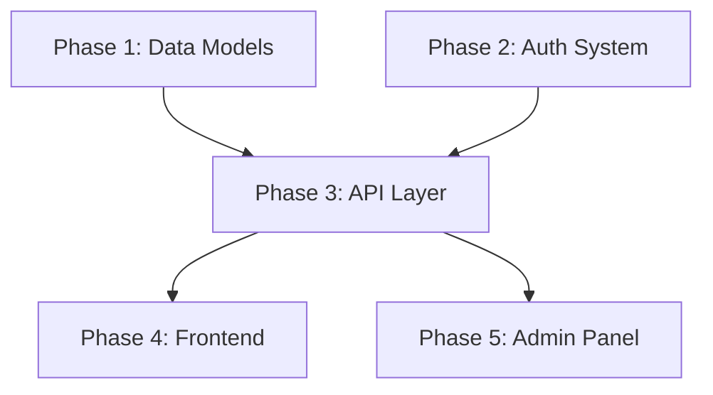

# /spec-master-plan - Master Plan Planning Phase

**Creates a master plan for multi-phase projects.** Master plans contain architecture, overarching goals, high-level context, and a list of child phases organized into waves for parallel execution.

**Input:** Task description (new master plan)
**Output:** Approved master plan + child plan stubs at `docs/plans/`
**Next:** On approval → `Skill(skill='spec-master-execute', args='<plan-path>')`

---

## When to Use

- Project requires multiple independent phases of work
- Work can be parallelized within waves (e.g., models + APIs in parallel, then UI)
- Scope is too large for a single plan (>12 tasks)
- Architecture decisions affect multiple child plans

---

## Step 0: Read Toggle Configuration

**Preferred:** Use `spec_init` MCP tool (returns config toggles, active plan state, and current task in one call).

---

## Step 1.1: Create Master Plan File Header

1. **Parse worktree** from arguments: `--worktree=yes|no`. Strip flag.
2. **Generate filename:** `docs/plans/YYYY-MM-DD-<slug>.md`
3. `mkdir -p docs/plans`
4. **Write initial header:**

```markdown
# [Project Name] Master Plan

Created: [Date]
Status: PENDING
Approved: No
Iterations: 0
Worktree: [Yes|No]
Type: Master

> Planning in progress...
```

5. **Register:** Use `spec_register` MCP tool.

---

## Step 1.2: Task Understanding & Clarification

1. Restate the project scope
2. Identify major phases (logical groupings of work)
3. **Ask Batch 1 questions** — scope, priorities, phase granularity

---

## Step 1.3: Exploration

Explore the codebase systematically to understand:
- Existing architecture and patterns
- Dependencies between components
- Areas that can be worked on in parallel

---

## Step 1.4: Design Decisions

Present wave ordering options with trade-offs. Use `AskUserQuestion`.

Key decisions:
- How to split work into phases
- Which phases can run in parallel (same wave)
- Which phases must be sequential (different waves)
- Architecture patterns that span all phases

---

## Step 1.5: Master Plan Structure

### Goal Section
State the overarching objective in 1-3 sentences.

### Architecture Section
Use **Mermaid diagrams** (rendered by GitHub) to show:
- Component relationships
- Data flow
- System boundaries
- Phase dependencies

Example:
````markdown

````

### Context Section
Domain knowledge, constraints, and key decisions that apply across ALL phases. This is the shared context every child plan needs.

### Waves Section
Explain wave ordering and dependency rationale:

```markdown
## Waves

**Wave 1** — Foundation (parallel): Data models and auth can be built independently.
**Wave 2** — Integration (parallel): API and services depend on Wave 1.
**Wave 3** — Presentation (parallel): UI depends on Wave 2.
```

### Phases Section
Table listing each child plan. Each child plan should include an `## Execution Waves` section to enable parallel task execution within that phase.

```markdown
## Phases

| Phase | Wave | Title | Objective | Dependencies |
|-------|------|-------|-----------|-------------|
| 1 | 1 | Data Models | Core database schema | None |
| 2 | 1 | Auth System | JWT auth + sessions | None |
| 3 | 2 | API Layer | REST endpoints | Phases 1, 2 |
| 4 | 3 | Frontend | User-facing UI | Phase 3 |
```

### Progress Tracking
Checkboxes per phase (not per task):

```markdown
## Progress Tracking

- [ ] Phase 1: Data Models (Wave 1)
- [ ] Phase 2: Auth System (Wave 1)
- [ ] Phase 3: API Layer (Wave 2)
- [ ] Phase 4: Frontend (Wave 3)

**Total Phases:** 4 | **Completed:** 0 | **Remaining:** 4
```

---

## Step 1.6: Generate Child Plan Stubs

For each phase, create a stub child plan file:

**Filename:** `docs/plans/YYYY-MM-DD-<master-slug>-phase-N.md`

```markdown
# [Phase Title]

Created: [Date]
Status: PENDING
Approved: No
Iterations: 0
Worktree: No
Type: Feature
Parent: [master-plan-slug]
Wave: [wave-number]

> Awaiting detailed planning. Run `/spec <this-file>` to plan this phase.

## Summary

**Goal:** [Phase objective from master plan]
**Context:** See master plan at `docs/plans/[master-plan-file]`
```

Child plans start as PENDING + Approved: No. They can be:
- Planned individually via `/spec <child-plan.md>` (routes to spec-plan)
- Planned with full tasks inline if scope is clear enough

---

## Step 1.7: Plan Verification

Launch plan-reviewer (when enabled) for the master plan.

---

## Step 1.8: Get User Approval

On approval: Set `Approved: Yes`, invoke `Skill(skill='spec-master-execute', args='<plan-path>')`

ARGUMENTS: $ARGUMENTS
